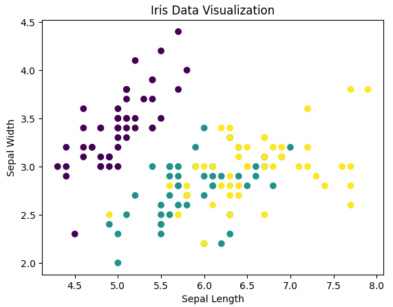

# Data_Analytics_Week6_Activity1_SVM_Classification_IRIS_dataset
# SVM Classification - Iris Dataset

This project uses the Iris dataset to train a Support Vector Machine (SVM) model with a linear kernel.

## Steps
- Load and clean the dataset
- Visualise data using a scatter plot
- Train and test the SVM model

## Result
The model achieved good accuracy on the test dataset.

## Visualisation

